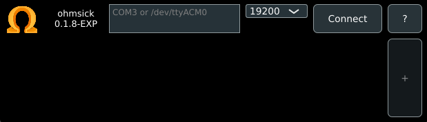
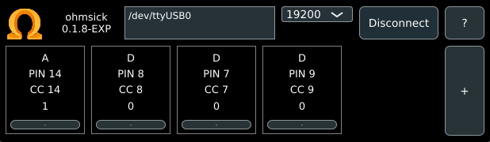
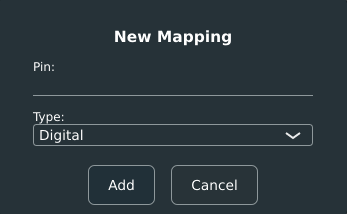

# <p align="center"></p>
<!-- data placeholders -->
<p align="center">
    Version: <b>0.2.0 EXP</b>
    &nbsp;&nbsp;&nbsp; / &nbsp;&nbsp;&nbsp;
    Branch: <b>main</b>
    &nbsp;&nbsp;&nbsp; / &nbsp;&nbsp;&nbsp;
    Release: <b>Experimental</b>
</p>
<b>Ohmsick</b> (a play on the word homesick) is a compatibility layer between microcontrollers like Arduinos and VST3 host applications.
<br><br>
This project contains 3 distinct systems. The 1st is the <b><i>firmware</i></b>, which is the binary that is flashed onto the microcontroller device itself. This handles communication between the hardware and the communication channel. The 2nd system is the <b><i>communication backend</i></b> which handles sending and recieving information on the communication channel. The final system is the <b>VST3 translator & frontend</b> which allows incoming and outgoing data to be integrated into host applications and configured.
<br><br>

# Installation & Build

This software is in an experimental (EXP) state. This means that there is not an official build of the software to download. Follow the following steps to build it yourself!
<br><br>

First, clone the repository onto your machine.

```shell
git clone https://github.com/Vaight/ohmsick.git
```

Ensure <b>CMake</b> is installed on your machine and your C++ compiler of choice. If you would like to use the premade build scripts, please have <code>G++</code> or <code>Visual Studio 18 2026</code> installed.

Now, ensuring you are within the folder, navigate to the <code>/scripts/</code> directory.

```shell
cd scripts
```

Use the script for your current platform to execute the build!

```shell
./build-linux.sh
./build-macos.zsh
./build-windows.ps1
```

If the provided scripts do not work or if you have your own build configuration, use cmake in your terminal directly. It will attempt to build the project with your current OS targets and specifications.

```shell
cmake -S . -B build -DCMAKE_BUILD_TYPE=Debug
cmake --build build
```

<br><br>

The compiled <b>VST3</b> is currently found at...

```
build-$target$/ohmsick_vst3_artefacts/Release/VST3/Ohmsick.vst
```

Included in this project is a really small VST3 debug host application. This currently can be found at...

```
build-$target$/debug_host_artefacts/Release/Ohmsick Debug Host
```

<br><br>

Be sure to flash your Arduino with the firmware using the Arduino IDE or equivalent program.<br>
The firmware can be found under the <b>/firmware/</b> directory as <b>firmware.ino</b>

<br><br>

# Plugin Usage

## Arduino Mapping & Connection

Once the VST3 is compiled, load it into your DAW or VST3 host of choice as a MIDI instrument / MIDI device.<br><br>
Opening the GUI will display the following blank screen. This screen may look slightly different between versions and devices.<br>

<br>

Now, connect your Arduino board (with the flashed firmware) to your computer using USB. Make sure the arduino lights up. Now, input the device port (COM{#} on windows and /dev/tty{device} on unix based systems) into the text box. To get help finding this device port, refer to [this page](https://www.mathworks.com/help/matlab/supportpkg/find-arduino-port-on-windows-mac-and-linux.html).
<br><br>
<b>NOTE: Currently the baud rate is hard-coded at 19200 in the firmware. Don't change the baud rate unless you change the firmware.</b><br>
Once you have found your device port and inputted it into the text box, click connect.<br>

<br>

If you have already configured the device, your assignments will show up as cards on the plugin.<br><br>
If you haven't yet, there will be no assignments, so click the "+" button to create one.<br>
You'll get this popup. Input your <b>integer</b> (1 = 1, 5 = 5, A0 = 14, A1 = 15 etc...) pin number on the arduino and set the input type.
> Digital &nbsp;&nbsp; -> &nbsp;&nbsp; Binary input, LOW = 0, HIGH = 127<br>
> Pullup &nbsp;&nbsp; -> &nbsp;&nbsp; Binary input, uses a pullup resistor internally, best for buttons, LOW = 127, HIGH = 0<br>
> Analog &nbsp;&nbsp; -> &nbsp;&nbsp; Analog input, ranges from 0 to 127

<br>

If you are unsure what the pin types are, PLEASE do research on Arduinos and electronics before you fry something!

Clicking add creates a new card with your values. Clicking the "-" button on a card removes it.<br><br>

## Using inputs in a DAW

To use the inputs to this VST3 in a DAW to change values and parameters, first we must understand what the plugin does behind the scenes.

The plugin functions as a MIDI instrument / MIDI input. However, the plugin itself does not produce MIDI notes. Instead, the plugin produces MIDI CC (Control Change) messages. Some examples of MIDI CC messages are pitch wheel, mod wheel, and other dynamic control messages. There are 128 MIDI CC values per channel, and since the plugin sits in a single channel, we have 128 possible assignments! (Even though the arduinos cant support that many).

So essentially, the plugin maps the value it recieves to a MIDI CC value. For example, if a button is assigned to pin 7, then the MIDI CC value for 7 is changed along with the button, alternating from 0 (minimum) to 127 (maximum) depending on the button state.

Using these MIDI CC messages is different per DAW, so I encourage you to watch some videos specific to the platform you are using. Usually however, you route midi output from this VST3 device to other devices input to use the MIDI CC messages.

<br><br>

# Tested boards
Currently the tested boards are as follows:
| Board | Status |
| - | - |
| Arduino Uno (ATmega328P) | Successful |
| Arduino Nano (ATmega328P) | Successful |

<br><br>

Thanks for taking the time to read this! Message me if you have any issues or problems with this project and i'll be happy to help!
